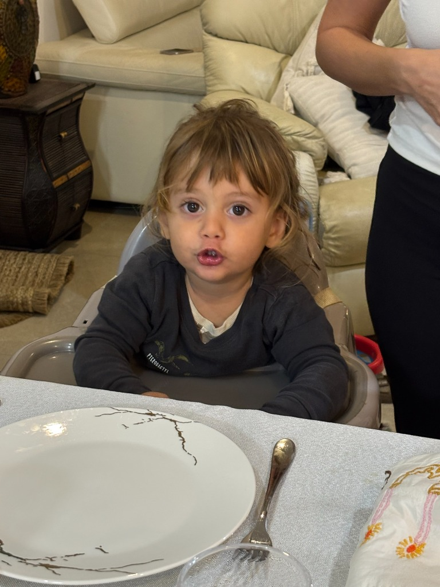
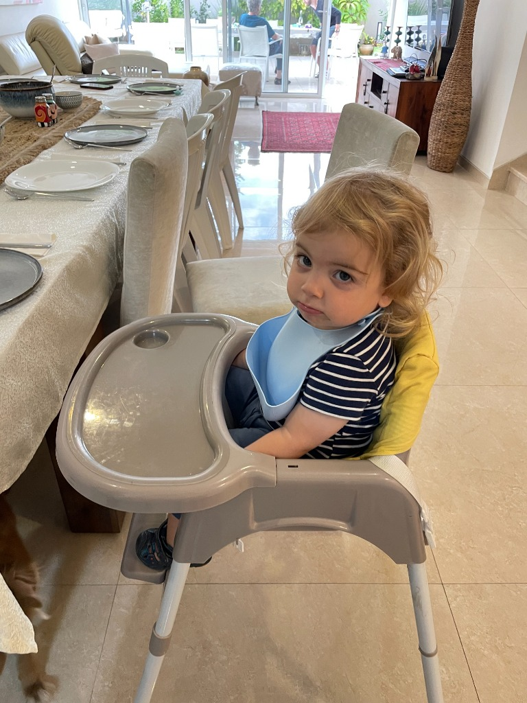

# Character Extraction - Original Method

Using the **current** `getCharacterExtractionPrompt`:

```
Analyze this image and create a highly detailed character reference description for an AI image generator.
Focus on:
- Physical features (face shape, eyes, nose, mouth, skin tone)
- Hair (color, style, length, texture)
- Age appearance
- Distinctive features
- Clothing style (if visible)

Be specific and detailed. This description will be used to generate consistent character illustrations.
```

---

## Character 1 - Toddler in Park


**Extraction (Original Method):**
A young toddler with light blonde, curly hair and blue-green eyes. The child has a round face with soft, rosy cheeks and a wide, open-mouthed smile showing small baby teeth. Fair skin with a warm, healthy complexion. Wearing a bright red short-sleeve t-shirt under classic blue denim overalls with metal snap closures.

---

## Character 2 - Woman in Car


**Extraction (Original Method):**
A young adult woman with long, straight blonde hair featuring light brown roots and honey-blonde undertones. She has light blue eyes and a friendly, natural smile showing upper teeth. Fair skin with a small beauty mark on her chin. Oval face shape with soft cheekbones. Wearing a dark navy blue t-shirt under a gray-blue cardigan.

---

## Character 3 - Toddler at Table


**Extraction (Original Method):**
A young toddler with medium-length light brown hair with bangs falling across the forehead. The child has large, expressive dark brown eyes and a round face with full cheeks. Olive-toned skin with a curious, slightly pouty expression. Wearing a dark charcoal gray sweatshirt over a white undershirt.

---

## Character 4 - Toddler in High Chair


**Extraction (Original Method):**
A young toddler with blonde, curly hair and blue-gray eyes. The child has a round face with soft features and a calm, observant expression. Fair skin. Wearing a navy blue and white striped t-shirt with yellow sleeves, and a light blue silicone bib around the neck.
